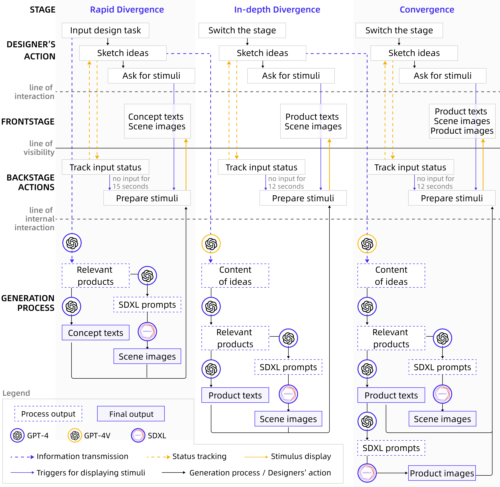

# InsPilot
The frontend for InsPilot: a multimodal creative stimulus system that aids designers by leveraging the capabilities of Large Language Models (LLM) and StableDiffusion (SD). Accompanying the paper [TODO: fill the link].

The backend: [InsPilot-api](https://github.com/LBruyne/InsPilot-api).

## Introduction

The overall usage process is shown in the figure below:


You can also refer to the video here: `./docs/mv.mp4`.

### Main Dependencies

- `node`: Run `node -v` to check if `node` is already installed. The node version used in the development environment is v16.16.0, but it can also run successfully on the server version v18.18.2.
- `react-sketch-canvas`: A community-open-sourced canvas library for drawing functionalities. There may be some bugs in the implementation, but there are no problems in current usage. It's essential to keep an eye on the library's updates and feature upgrades. Reference: <https://github.com/vinothpandian/react-sketch-canvas>
- `tailwindcss`: A widely-used CSS library.
- `next.js`.

### Project Architecture

The project structure is as follows:

``` sh
├── LICENSE
├── next.config.js
├── next-env.d.ts
├── package.json
├── package-lock.json
├── postcss.config.js
├── public
│   ├── fonts
│   ├── icons
│   └── images
├── README.md
├── src
│   ├── app
│   ├── components
│   ├── configs
│   ├── lib
│   ├── mocks
│   ├── services
│   ├── styles
│   ├── theme
│   └── types.d.ts
├── tailwind.config.ts
├── tsconfig.json
└── typings.d.ts
```

Configuration files are located in `./src/configs`, including:

- `env.ts`: API service configuration.
- `routes.ts`: Page routing configuration. When adding new pages, first add new page files in the `app` folder, then configure corresponding page information in `routes.ts` (otherwise, navigation will not be possible).
- `site.ts`: Site information configuration. You can configure information such as the website name, logo, and introduction.

## Quick Start

### Local Deployment

1. Please start the API service before running, which is the `Refinity-api` project (URL configuration is located in `./src/configs/env.ts`).
2. Run the command `npm install` or `yarn` to install the project's required dependencies (`node_modules`).
3. Execute the command `npm run dev` to start the project at the specified port (default is 3000).
   The frontend page can be viewed in the browser at `localhost:port`.

### Production Deployment

1. Please start the API service before running (URL configuration is located in `./src/configs/env.ts`).
2. Run the command `npm install` or `yarn` to install the project's required dependencies (`node_modules`).
3. Build the project by running the command `npm run build` in the project directory.
4. After building, start the production server by executing `npm run start`.
5. In a production environment, it is recommended to use a process manager (such as PM2) and monitoring tools to maintain application stability and address any potential issues timely. First, install `pm2`, then you can use the command: `pm2 start npm --name "Refinity" -- start` to ensure the service continues running on the server after SSH is closed.
